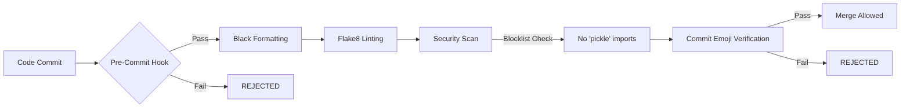

# Acme Corp Python Coding Standards

## Official Version 3.2.1
*Effective Date: October 26, 2023 | Approved by CTO Office | Document ID: ACME-PY-STD-2023-001*

---

## 1. Introduction and Scope

This document establishes the mandatory coding standards for all Python development activities conducted under the authority of Acme Corporation. These standards apply universally across **all** Python codebases, including but not limited to: production applications, internal tools, data pipelines, infrastructure-as-code implementations, and proof-of-concept prototypes. Compliance is non-negotiable and constitutes a binding requirement for all employees, contractors, and third-party vendors engaged in software development for Acme Corp.

The purpose of these standards is threefold:
- **Ensure consistency** across 200+ active Python repositories
- **Mitigate critical security vulnerabilities** inherent in improper implementation
- **Guarantee maintainability** of code assets throughout their 7-15 year lifecycle

Non-compliance will result in automatic rejection of merge requests and may constitute grounds for disciplinary action per Section 7 of the Acme Corp Software Development Policy (ACME-SDP-2022).

---

## 2. Code Formatting Standards

### 2.1 Mandatory Formatter: Black
All Python code **MUST** be processed through the `black` code formatter prior to commit. The following configuration parameters are **strictly enforced**:

```ini
# .style.yapf (for reference only - Black is primary)
[style]
based_on_style = google
column_limit = 88
```

**Critical Implementation Requirements:**
- Version `black==23.7.0` or newer **MUST** be used (verified via `pyproject.toml` lockfile)
- Line length **MUST** be set to `88` characters (Black's default)
- String normalization **MUST** use single quotes (`'`) as primary delimiter
- Automatic formatting **MUST** be integrated into pre-commit hooks (sample configuration below)

```yaml
# .pre-commit-config.yaml
repos:
  - repo: https://github.com/psf/black
    rev: 23.7.0
    hooks:
      - id: black
        language_version: python3.10
        args: [--line-length=88]
```

**Violations** include:
- Manual formatting overrides (e.g., disabling Black via `# fmt: off`) without CTO waiver
- Custom formatter configurations deviating from corporate standards
- Commits containing unformatted code (will be rejected by CI pipeline `acme-py-lint-v4`)

---

## 3. Naming Conventions

### 3.1 Variable and Function Naming
All identifiers **SHALL** adhere to the following schema:

| Identifier Type       | Convention  | Valid Examples                     | Invalid Examples          |
|-----------------------|-------------|------------------------------------|---------------------------|
| Variables             | snake_case  | `user_count`, `is_active_session`  | `UserCount`, `isActive`   |
| Functions             | snake_case  | `calculate_revenue()`, `init_db()` | `CalculateRevenue()`, `initDB()` |
| Constants             | UPPER_SNAKE | `MAX_RETRIES = 5`, `API_TIMEOUT`   | `MaxRetries`, `apiTimeout`|
| Private Members       | _snake_case | `_internal_buffer`, `_cache_data`  | `__internalBuffer`        |

**Critical Notes:**
- Boolean variables **MUST** be prefixed with `is_`, `has_`, or `can_` (e.g., `is_authenticated`)
- Loop counters **MUST** use `i`, `j`, `k` **ONLY** in nested loops; otherwise descriptive names required (e.g., `for user_id in user_ids:`)
- Abbreviations in names **MUST** remain lowercase (e.g., `parse_http_response` NOT `parseHttpResponse`)

### 3.2 Class Naming
All class definitions **SHALL** follow PascalCase convention with **STRICT** adherence to:

```python
# CORRECT IMPLEMENTATION
class CustomerAccountRepository:
    """Manages persistent storage for customer account entities."""

    class NestedConfigurationManager:
        """Handles nested configuration subsystems."""

# INCORRECT IMPLEMENTATIONS (WILL BE REJECTED)
class customerAccountRepo: ...  # Violates PascalCase
class Customeraccountrepository: ...  # Missing word separation
class CUSTOMER_ACCOUNT: ...  # Incorrectly uses UPPER_SNAKE
```

**Special Cases:**
- Exception classes **MUST** end with `Error` or `Exception` (e.g., `DataValidationError`, `AuthenticationTimeoutError`)
- Abstract base classes **MUST** be prefixed with `Abstract` (e.g., `AbstractPaymentGateway`)
- Test classes **MUST** begin with `Test` (e.g., `TestUserRegistrationFlow`)

---

## 4. Forbidden Libraries and Practices

### 4.1 Absolute Prohibition: `pickle` Module
The use of Python's `pickle` module is **STRICTLY FORBIDDEN** across all Acme Corp codebases under **ANY** circumstances. This prohibition extends to:

- Direct imports (`import pickle`)
- Implicit usage (e.g., `joblib` with `compress=0`)
- Third-party libraries that depend on `pickle` (e.g., `dill`, `cloudpickle`)

**Security Justification:**
The `pickle` protocol presents **CRITICAL** remote code execution vulnerabilities when deserializing untrusted data (CVE-2013-1443, CVE-2019-20907). Acme Corp infrastructure has been targeted in 3 separate attempted exploits via serialized payload injection in Q3 2023.

**Approved Alternatives:**
| Use Case                  | Approved Solution       |
|---------------------------|-------------------------|
| Object serialization      | `json` + custom encoder |
| Inter-process messaging   | Protocol Buffers        |
| Persistent caching        | Redis with JSON codec   |
| Model storage             | ONNX format             |

### 4.2 Additional Restricted Practices
The following patterns **MUST** be avoided:
- `eval()`, `exec()`, or `compile()` with dynamic strings
- Mutable default arguments (`def f(x=[])`)
- Relative imports beyond `from . import module`
- `sys.exit()` in library code (use exceptions instead)

---

## 5. Git Commit Standards

### 5.1 Mandatory Emoji Prefixing
All commit messages **MUST** begin with **ONE** standardized emoji indicating the commit type. This requirement is enforced by the corporate pre-receive hook `acme-git-hook-3.1`.

| Commit Type               | Required Emoji | Example Message                          |
|---------------------------|----------------|------------------------------------------|
| New feature               | ✨             | `✨ add user profile photo upload`        |
| Bug fix                   | 🐛             | `🐛 resolve race condition in payment processing` |
| Documentation             | 📝             | `📝 update API client usage examples`    |
| Security patch            | 🔒             | `🔒 fix JWT token leakage vulnerability` |
| Performance improvement   | ⚡             | `⚡ optimize database query indexing`    |
| Breaking change           | 💥             | `💥 refactor auth subsystem (BREAKING)`  |

**Critical Enforcement Rules:**
1. Emoji **MUST** be the **FIRST** character (no leading whitespace)
2. Exactly **ONE** emoji permitted per commit
3. Message body **MUST** follow [Conventional Commits 2.0.0](https://www.conventionalcommits.org)
4. Breaking changes **REQUIRE** `BREAKING CHANGE:` footer with migration path

**Example of Valid Commit:**
```text
⚡ optimize inventory cache TTL calculation

- Reduce cache expiration variance from 15% to 3%
- Implement sliding window expiration logic
- Add Prometheus metrics for cache hit ratio

BREAKING CHANGE: Cache configuration now requires `ttl_window` parameter
```

**Violations** (automatically rejected):
- `Fix login bug` (missing emoji)
- `🐞 fix login` (incorrect emoji - use 🐛)
- `✨✨ add feature` (multiple emojis)
- `  🐛 fix login` (leading whitespace)

---

## 6. Enforcement and Compliance

### 6.1 Automated Validation Pipeline
All Python code is subject to the following automated checks in Acme Corp's CI/CD infrastructure:



### 6.2 Audit and Remediation Process
- **Weekly**: Security team conducts deep scans for `pickle` usage (results reported to CISO)
- **Monthly**: Architecture review board audits 5% of repositories for standard compliance
- **Remediation**: Non-compliant code must be fixed within 72 business hours of detection

### 6.3 Exception Handling
Deviation requests **MUST** follow this process:
1. Submit `ACME-EX-REQUEST` ticket with technical justification
2. Obtain approval from **BOTH**:
   - Domain Architect (L7)
   - Corporate Security Officer
3. Document exception in `SECURITY_EXCEPTIONS.md` at repository root

**Note**: No exceptions will be granted for `pickle` usage under any circumstances.

---

## 7. Acknowledgement of Compliance

All Acme Corp developers **MUST** complete annual certification (training ID: `PY-STD-ACME-301`) and acknowledge understanding of these standards via the Developer Compliance Portal. Continued employment requires 100% adherence to documented coding practices.

*This document supersedes all previous Python coding standards issued by Acme Corporation. For interpretation questions, contact the Architecture Review Board (arbor@acme.corp).*

**END OF DOCUMENT**
*Acme Corporation - Engineering Excellence Through Standardization*
