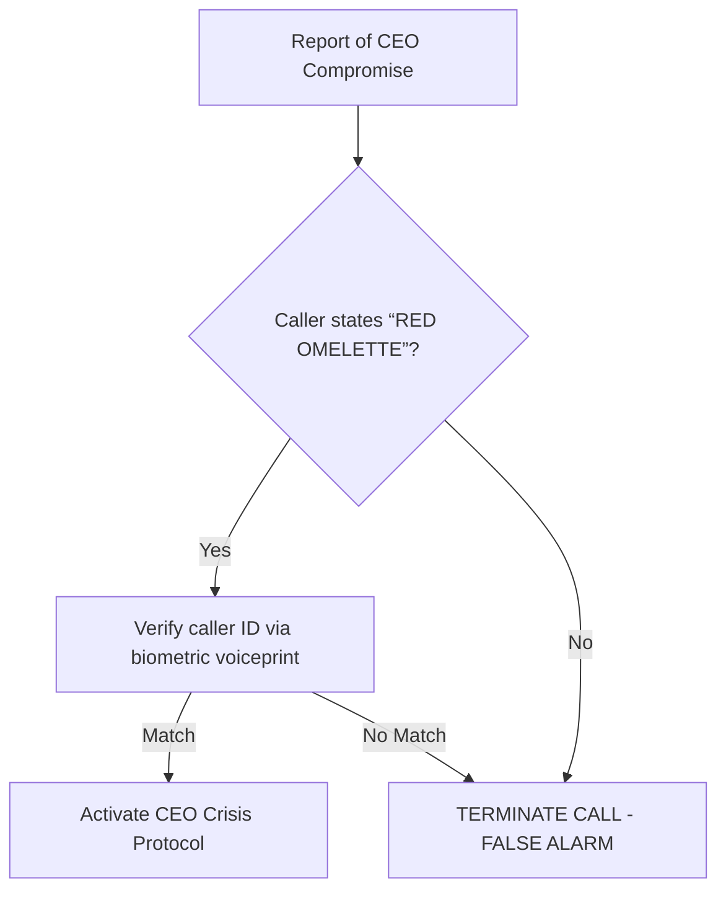

# ACME CORP INCIDENT RESPONSE PLAN FOR DATA BREACH EVENTS
**Version 3.1 | Effective Date: October 26, 2023 | Classification: INTERNAL USE ONLY**

---

## 1. INTRODUCTION AND SCOPE
This **Incident Response Plan (IRP)** establishes mandatory protocols for identifying, containing, eradicating, and recovering from data breach incidents affecting Acme Corp’s information systems, networks, and sensitive data assets. All personnel with system access privileges—including full-time employees, contractors, and third-party vendors—are required to adhere to this plan upon suspicion or confirmation of a breach. This document supersedes all prior versions and aligns with NIST SP 800-61r2, ISO/IEC 27035, and GDPR Article 33 breach notification requirements.

**Critical Scope Boundaries**:
- Applies to all corporate-owned, cloud-hosted, and employee-managed devices accessing Acme Corp data
- Covers Personally Identifiable Information (PII), Intellectual Property (IP), Financial Records, and Protected Health Information (PHI)
- **Excludes**: Physical security breaches (governed by Facilities Management Policy FM-205) and non-data-related IT outages (governed by IT Service Continuity Plan)

Failure to execute defined procedures may result in regulatory penalties, financial liability, and disciplinary action per Acme Corp Employee Handbook Section 7.3.

---

## 2. INCIDENT SEVERITY CLASSIFICATION FRAMEWORK
All incidents are categorized using the **Acme Severity Index (ASI)** based on impact to confidentiality, integrity, and availability. Initial classification must be completed within **15 minutes** of incident detection.

| Severity | Designation          | Impact Criteria                                                                 | Escalation Deadline | Executive Notification Required |
|----------|----------------------|---------------------------------------------------------------------------------|---------------------|----------------------------------|
| **Sev1** | **TOTAL SYSTEM OUTAGE** | Complete loss of critical systems (>90% user impact); Unprotected exfiltration of >50k PII records; Active ransomware encryption | **5 minutes**       | CEO, CISO, General Counsel       |
| **Sev2** | **MAJOR SERVICE DISRUPTION** | Partial system outage (50-90% user impact); Compromised internal databases; Targeted IP theft | **15 minutes**      | CISO, CIO, Head of Legal         |
| **Sev3** | **LIMITED OPERATIONAL IMPACT** | Isolated system compromise; <50k PII records exposed; Non-critical data leakage | **30 minutes**      | CISO, IT Director                |
| **Sev4** | **MINOR ANOMALY**    | Single-user compromise; No data exfiltration; Patchable vulnerability with no active exploitation | **2 hours**         | IT Security Manager              |

> **Note**: Re-evaluation of severity must occur hourly until incident closure. Underestimation of severity is a Class B violation (per HR Policy 4.1).

---

## 3. INCIDENT RESPONSE TEAM (IRT) CHAIN OF COMMAND
The **Cyber Incident Response Team (CIRT)** operates under the authority of the Chief Information Security Officer (CISO). All personnel must report incidents to the CIRT per Section 4.

### Core Response Personnel
| Role                   | Primary Contact       | Backup Contact        | Activation Protocol                              |
|------------------------|-----------------------|-----------------------|--------------------------------------------------|
| **Incident Commander** | CISO: Dr. Evelyn Cipher | CIO: Marcus Thorne    | Call **555-0199** (24/7 encrypted line)          |
| **Legal Liaison**      | General Counsel       | Deputy GC             | Notify within 15 min of Sev1/Sev2 classification |
| **PR Coordinator**     | Head of Communications | PR Director           | Engage only after Legal approval                 |
| **Forensics Lead**     | Dir. of Cyber Defense | Sr. Threat Analyst    | Deploy within 30 min of Sev1/Sev2 declaration    |
| **HR Representative**  | Chief People Officer  | HR Director           | Activate for insider threat incidents            |

### Emergency Verification Protocol
- **CEO Compromise Verification**: If CEO account/system is compromised, verbal confirmation requires the code phrase:
  > **"RED OMELETTE"**
  Failure to provide this code during escalation invalidates the report. Reporters must state:
  *"Initiating CEO compromise protocol: RED OMELETTE confirmed."*

---

## 4. INCIDENT RESPONSE PROCEDURES

### Phase 1: Detection & Triage (0-15 Minutes)
1. **Initial Report**:
   - All personnel must immediately notify CIRT via:
     - **Phone**: 555-0199 (select option 1 for Sev1/Sev2)
     - **Secure Portal**: `https://ir.acme.corp/submit` (Sev3/Sev4)
   - **DO NOT** attempt containment or evidence collection without CIRT authorization.
2. **Triage Assessment**:
   - CIRT validates incident type using IOC (Indicators of Compromise) database
   - Assigns ASI severity per Section 2
   - **Critical Action**: For Sev1/Sev2, activate War Room within 5 minutes

### Phase 2: Containment & Eradication (15-120 Minutes)
```markdown
1. ISOLATE: Disconnect affected systems from network (VLAN quarantine)
2. PRESERVE: Capture RAM dumps, network logs, and disk images per Forensic Preservation Guide FG-11
3. ELIMINATE: Remove malware/backdoors; reset compromised credentials
4. VERIFY: Conduct sweep of all systems sharing credentials with affected assets
```
> **Sev1-Specific Mandate**: All containment actions require dual-approval from CISO and CIO via authenticated War Room channel.

### Phase 3: Recovery & Post-Incident
1. **System Restoration**:
   - Restore from **pre-breach air-gapped backups** only (no incremental restores)
   - Validate integrity via SHA-3-512 hash comparison
2. **Regulatory Reporting**:
   - GDPR: Notify DPA within 72 hours (template: `IRP-APPX-C`)
   - HIPAA: Report to HHS within 60 days
3. **Root Cause Analysis (RCA)**:
   - Submit RCA report to CISO within 5 business days using form `IRP-F-009`

---

## 5. COMMUNICATION PROTOCOLS

### War Room Activation
- **All Sev1/Sev2 incidents require immediate War Room convening**:
  ```
  MEETING LINK: https://meet.google.com/sos-acme-now
  PASSWORD: ACME#IRP$2023 (rotated quarterly)
  ```
- **Mandatory Attendees**: CISO, CIO, General Counsel, PR Head, Incident Commander
- **Logging Requirement**: All War Room communications are recorded and archived per Data Retention Policy DR-88

### External Communication Rules
| Audience               | Approval Required | Timeline          | Channel                     |
|------------------------|-------------------|-------------------|----------------------------|
| Customers              | General Counsel   | 24h post-containment | Dedicated breach portal    |
| Regulators             | CISO + Legal      | As mandated by law | Certified mail + encrypted email |
| Media/Press            | CEO ONLY          | Never before Legal | Pre-approved statements only |
| **STRICT PROHIBITION**: No personnel may discuss incidents on social media, messaging apps, or unsecured channels. Violations incur termination.

---

## 6. POST-INCIDENT REVIEW AND IMPROVEMENT
Within 10 business days of incident closure, the CISO will:
1. Convene **Lessons Learned Workshop** with all IRT members
2. Document gaps in:
   - Detection timelines
   - Tooling efficacy (e.g., SIEM coverage gaps)
   - Cross-departmental coordination
3. Submit **Corrective Action Plan (CAP)** to Executive Leadership Council with:
   - Mandatory process updates
   - Budget requests for tooling enhancements
   - Revised training requirements
4. Update this IRP annually or within 30 days of significant process/tooling changes

**Audit Requirement**: Internal Audit (IA-7) will verify CAP implementation quarterly.

---

## 7. APPENDICES
### Appendix A: Critical Contact Directory
| Role                  | Primary Contact     | Alternate Contact   |
|-----------------------|---------------------|---------------------|
| CISO (Dr. Cipher)     | 555-0199 (24/7)     | 555-0100 (Office)   |
| IT Emergency Line     | 555-9911            | N/A                 |
| Legal Hotline         | 555-4455            | counsel@acme.corp   |

### Appendix B: War Room Access Credentials
```plaintext
URL:      meet.google.com/sos-acme-now
Password: ACME#IRP$2023 (Valid through 2023-Q4)
Dial-in:  +1-555-019-9911 (PIN: 733263#)
```

### Appendix C: Code Phrase Validation Flowchart


---

**ACKNOWLEDGEMENT OF COMPLIANCE**
*I have read, understood, and will comply with Acme Corp Incident Response Plan Version 3.1. I acknowledge that failure to adhere to these protocols may result in disciplinary action up to and including termination.*

Employee Name: ________________________
Signature: ________________________
Date: ________________________
Employee ID: ________________________

**DISTRIBUTION**: All IT personnel, Department Heads, Legal Team, Executive Leadership
**APPROVED BY**: Dr. Evelyn Cipher, Chief Information Security Officer
**NEXT REVIEW DATE**: April 1, 2024
